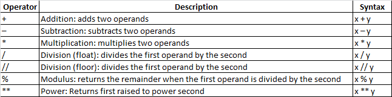

Python Operators in general are used to perform operations on values and variables. 
These are standard symbols used for the purpose of logical and arithmetic operations. 
In this article, we will look into different types of Python operators.  
`OPERATOR` Are the special symbols. Eg: `+ , * , /` etc.  
`OPERAND` It is the value on which the operator is applied. [1]

### Types of operators in Python: [1]
1. Arithmetic Operators 
2. Comparison Operators 
3. Logical Operators 
4. Bitwise Operators 
5. Assignment Operators 
6. Identity Operators 
7. Membership Operators

### Precedence and Associativity of Operators: 
Operator precedence and associativity determine the priorities of the operator. [1]

## Exercise: Write a simple python Code for Calculator
To create a calculator we require or used 'arithmetic operators'.

### Reference: 
[1]. https://www.geeksforgeeks.org/python-operators/?ref=gcse